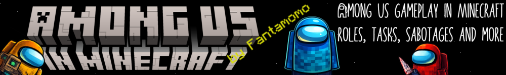

# Among Us in Minecraft

> A fan-made Minecraft plugin that brings the gameplay of Among Us to Minecraft.

**[🕮 Documentation](https://docs.among-us-in-minecraft.fantamomo.com/)** · **[🗺️ Map Setup](https://docs.among-us-in-minecraft.fantamomo.com/demo/map/)** · **[🎮 Demo Server](https://docs.among-us-in-minecraft.fantamomo.com/demo/server)**

> [!WARNING]  
> This project is **not affiliated with, endorsed by, or associated with Innersloth or Mojang Studios**.  
> All trademarks and IP related to **Among Us** belong to **Innersloth**.  
> All trademarks and IP related to **Minecraft** belong to **Mojang Studios**.  
> This is an independent, non-commercial fan project for educational and entertainment purposes.

---

## Features

- **18+ Roles** - And more coming soon. ([List](https://among-us-in-minecraft.docs.fantamomo.com/roles/roles))
- **Fully Customizable** – Play on every map – customize where tasks, sabotages, vents, cameras, and much more is.
- **Various tasks** – Inspired by Among Us (especially Polus), fully rebuilt in Minecraft.
- **Maps** – Create your own maps or use the pre-built one.

Check out the [documentation](https://among-us-in-minecraft.docs.fantamomo.com/) for more information.

---

## Getting Started

Visit the [documentation](https://among-us-in-minecraft.docs.fantamomo.com/guides/getting-started) for more information.

In short, you'll need:
1. A Minecraft server. (Paper: `1.21.11`)
2. Place the plugin in your `/plugins` folder.
3. Set up a map or download the [pre-built](https://among-us-in-minecraft.docs.fantamomo.com/demo/map) one.
4. Play with your friends!

---

## Project Status

**This plugin is still in active development.**

The core functionality is complete, and the plugin can be played with.

But some features are still incomplete and being worked on.

Also, there are some known bugs that are being worked on.

---

## Demo

We have a demo server running the plugin. [Check it out](https://among-us-in-minecraft.docs.fantamomo.com/demo/demo)

---

## Intellectual Property

This project uses **no original Among Us assets** — no textures, sounds, models, UI elements, or source code.

All gameplay is recreated from scratch using vanilla Minecraft systems:
- Tasks use **Minecraft inventory GUIs**
- Progress is tracked via **Minecraft events**
- Visuals rely entirely on **Minecraft items and blocks**

Some task and role names are borrowed from Among Us purely for recognizability and are used descriptively only.

---

## Legal Notice

- Not an official Among Us product
- Not affiliated with Innersloth LLC.
- No original Among Us assets are used
- Fan-made recreation inspired by the gameplay

---

## Licence

Code: [Apache License 2.0](LICENSE)

Asserts (e.g., banner, logo): All rights reserved.  
Contains fan-made artwork inspired by Among Us and Minecraft.
All trademarks belong to their respective owners.

---

## Author

[Fantamomo](https://github.com/Fantamomo)
